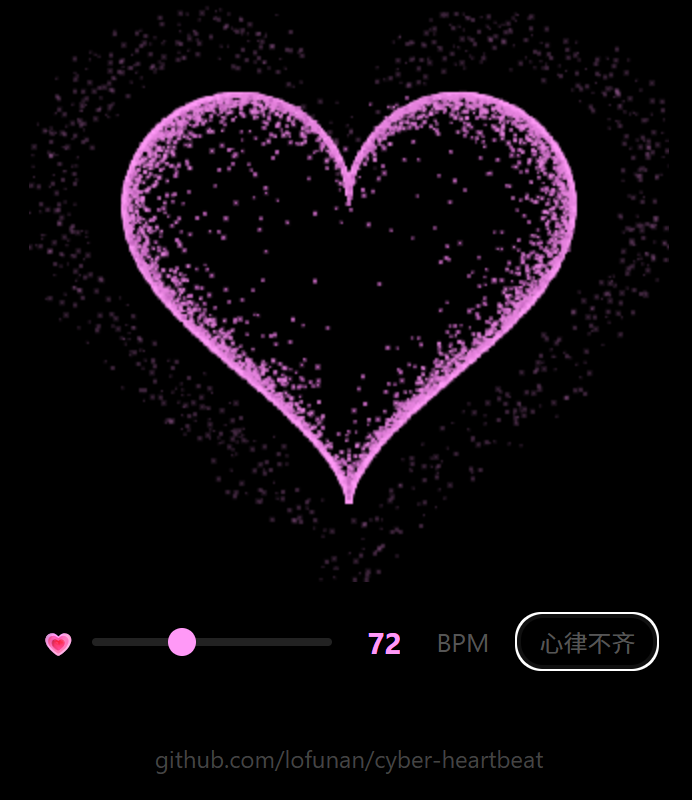

# 💗 cyber-heartbeat

**情绪积温 + BPM 心跳可视化引擎**



用于AI聊天/人机恋/虚拟角色聊天场景。每次用户发消息，系统根据语气分类（warm/neutral/cool/hurt）积累"情感积温"，映射为心率 BPM，实时驱动前端爱心粒子动画。

---

## 原理

```
用户消息 → 情绪分类 → 积温累积 → BPM 映射 → 前端可视化
                                          ↓
                                    AI Prompt 注入
```

### 情绪积温

| 分类 | delta | 含义 |
|---|---|---|
| `warm` | +0.2 | 想念、撒娇、爱意、道歉 |
| `neutral` | 0.0 | 分享信息、讨论事务 |
| `cool` | -0.1 | 心不在焉、简短回复 |
| `hurt` | -0.3 | 不满、怒气 |

- 值域 `[-1.0, 1.0]`，持久化到 `mood.json`
- 时间衰减：30min→×0.8 / 2h→×0.5 / 8h→×0.3
- 久别重逢：间隔 > 2h → delta × 1.5
- 中性回归：delta=neutral 且 |mood|>0.05 → mood × 0.9

### BPM 映射

```
BPM = clamp(72 + mood × 50, 40, 130)
强度 = 1.0 + |mood| × 0.2
心律不齐 = 最近5次delta波动 > 0.35
```

### AI Prompt 注入

```
【情绪状态】
趋势回暖，温暖满足，语气可以温柔些
你现在的心跳为96BPM
```

分段指引：
| mood | 文本 |
|---|---|
| > 0.4 | 温暖满足，语气可以温柔些 |
| > 0.1 | 轻松平和，自然地聊就好 |
| > -0.1 | 中性，正常发挥 |
| > -0.4 | 情绪不高，话可以少一些 |
| ≤ -0.4 | 低落或烦躁，简短冷淡 |

---

## 文件说明

```
cyber-heartbeat/
├── engine.py         情绪核心（load/save/tick/accumulate/BPM）
├── prompt.py         AI Prompt 文本生成
├── demo.py           CLI 演示
├── heart.html        前端爱心粒子（双击即开）
├── mood.json         示例数据文件
├── LICENSE           MIT 协议
└── README.md         本文件
```

### 快速开始

```bash
# 1. CLI 演示模拟一轮情绪变化
python demo.py

# 2. 打开前端动画
# 双击 heart.html（浏览器打开即可）
```

---

## 接入指南

### Python 后端

```python
from engine import load_mood, tick_mood, accumulate, mood_to_bpm
from prompt import build_mood_block

# 每次用户发消息时：
mood = tick_mood()                              # 加载+衰减
mood = accumulate("warm", mood, last_updated)    # 累积
bpm = mood_to_bpm(mood)                         # → BPM
block = build_mood_block(mood, delta_val)        # → 要注入的文本
```

### 前端

`heart.html` 是独立的单页。要集成到你的项目中，只需：

1. 从后端接收 BPM 数据
2. 用 BPM 值驱动呼吸动画（参考 `heart.html` 中的 `render()` 函数）
3. 滑块 → BPM 数值变化 → 心率变化

---

## 致谢

情绪积温的概念和实现受 [**ClaraShafiq/jiwen**](https://github.com/ClaraShafiq/jiwen) 启发。  
jiwen 是一个 ~500 行的 JS 引擎——用五轴连续数值（连接需求、骄傲、愉悦度、唤醒度、沉浸度）替代概率骰子，让 AI 角色知道自己「什么时候该说话」，而不是靠随机数碰运气。

本仓库取其"积温"之名与持续性情绪累积的思想，简化为单轴 warmth → BPM 映射 + 前端可视化，适配AI聊天场景。

---

## 许可

MIT — 随意使用、修改、分发。
